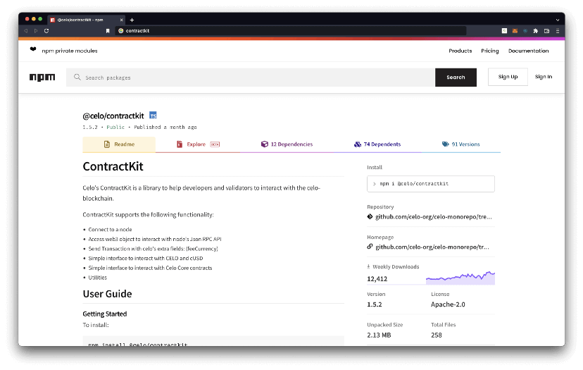
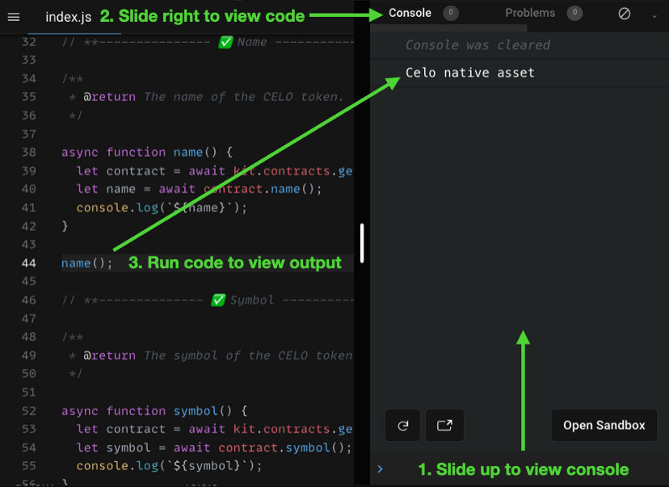
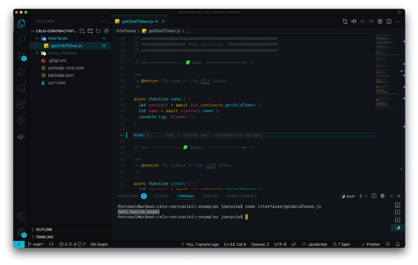
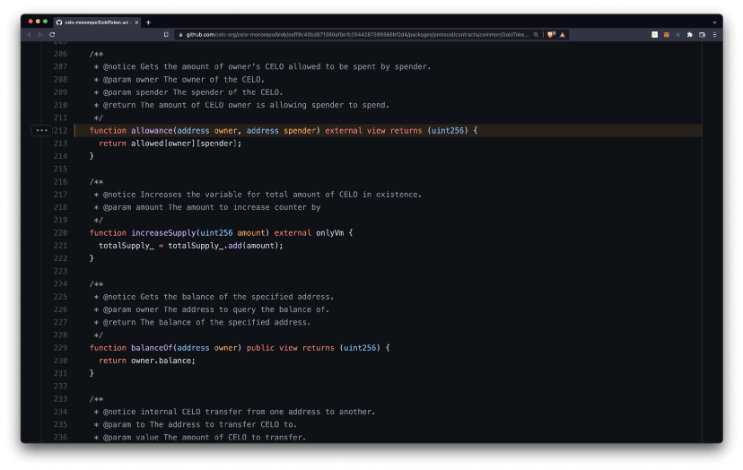

import YouTube from '@components/YouTube';

# ContractKit: A Practical Guide to Interacting with the Celo Core Contracts

_How to access the Celo Blockchain with JavaScript using ContractKit._

## Hello Developers 🌱

Welcome to today’s post, where we’ll break down a blockchain topic into bite-sized pieces to help you learn and apply your new skills in the real world.

Today’s topic is How to interact with the Celo Blockchain using ContractKit.

**Here’s a list of what we’ll cover 🗒**

- ✅ **Step 1:** Environment setup
- ✅ **Step 2:** Imports, variables & connections
- ✅ **Step 3:** Name
- ✅ **Step 4:** Symbol
- ✅ **Step 5:** Total supply
- ✅ **Step 6:** Decimals
- ✅ **Step 7:** Balance of
- ✅ **Step 8:** Transfer
- ✅ **Step 9:** Transfer with comment
- ✅ **Step 10:** Experiment with your code

By the end of this post, you’ll be able to interact with the Celo blockchain using ContractKit to access the Celo Core Contracts.

Let’s go! 🚀

## What is ContractKit?​

[ContractKit](https://docs.celo.org/developer-guide/contractkit) is a library to help you interact with the Celo blockchain and allows you to integrate Celo smart contracts into your applications easily.



**Here are a few things you can do with ContractKit:**

- Connect to a Celo node
- Interact with Celo Core contracts
- Send transactions on Celo
- …and more!

In this post, we’ll focus on the [GoldToken.sol](https://github.com/celo-org/celo-monorepo/blob/master/packages/protocol/contracts/common/GoldToken.sol) contract, but you can use ContractKit to interact with any of the [Celo Core Contracts](https://joenyzio.medium.com/17-powerful-celo-protocol-core-contracts-you-need-to-know-d84c1fbc5a6).

### use-contractkit

To extend `ContractKit`, Celo also built [use-contractkit](https://github.com/celo-org/use-contractkit) to make it easy to access all of the ContractKit features within your React applications.


This post will focus on `ContractKit`, and we’ll discuss `use-contractkit` in more detail in a later post.

## ✅ Step 1: Environment setup

There are two ways you can follow along with this post. First, you can use the Code Sandbox to use ContractKit from your browser. Alternatively, you can use the local environment setup by cloning the GitHub repo for this post.

### Using Code Sandbox

The Code Sandbox includes all of the code used in this tutorial and allows you to run and edit ContractKit from your browser.



## Try the Code Sandbox

Open the code and terminal to use the Code Sandbox as shown above.

Uncomment `name();` on line 44.

This will display the name of the Celo Native Asset in your terminal!

<iframe
  src="https://codesandbox.io/embed/brave-dawn-ebxfq0?fontsize=14&hidenavigation=1&theme=dark"
  title="brave-dawn-ebxfq0"
  allow="accelerometer; ambient-light-sensor; camera; encrypted-media; geolocation; gyroscope; hid; microphone; midi; payment; usb; vr; xr-spatial-tracking"
  sandbox="allow-forms allow-modals allow-popups allow-presentation allow-same-origin allow-scripts"
></iframe>

Congratulations! You’ve successfully run ContractKit from your Code Sandbox. You can explore, run, and edit the code in this file to learn more about how this code is working.

:::tip

You can also select [Open Sandbox](https://codesandbox.io/s/frosty-browser-rfm6fz?from-embed) for a more interactive code experience. Learn more about [Code Sandbox here](https://codesandbox.io/).

:::

### Using local environment

The code for this post is also located in this [GitHub repository](https://github.com/joenyzio/celo-contractkit-examples). You may clone this repo to follow this post from your local environment.



### Clone the GitHub Repo

```
git clone https://github.com/joenyzio/celo-contractkit-examples.git
```

### Navigate into the project folder

```
cd celo-contractkit-examples
```

### Install dependencies

Dependencies for this project include `contractkit`, `dotenv`, and `web3`.

```
npm install
```

### Open in Visual Studio Code (or your preferred environment)

```
code .
```

### View and Run Code

The file used for this post is located at interfaces > getGoldToken.js. You may run this file at any time from your terminal using…

```
node interfaces/getGoldToken.js
```

### Try the Local Environment

Here is how you can read the name of the `Celo Native Asset` from your local environment.

- Uncomment `name();` on line 44
- Run node `interfaces/getGoldToken.js` from your terminal

Congratulations! You’ve successfully run ContractKit from your local environment. You can explore, run, and edit the code in this file to learn more about how this code is working as you read this post.

## ✅ Step 2: Imports, variables, & connections

This project contains a JavaScript file named `contractkit.js` that includes all project code. The first step to using ContractKit in this file is importing dependencies and setting up the project variables.

### Import Web3

[Web3](https://github.com/ChainSafe/web3.js/blob/1.x/README.md) is an Ethereum [JavaScript API](http://web3js.readthedocs.io/) that allows you to connect to the Ethereum blockchain. Since Celo is fully EVM compatible, you can also use this to connect to the Celo blockchain as `const Web3`.

```
const Web3 = require("web3");
```

### Define web3

Using `Web3` allows you to connect to a Celo node by providing the node’s endpoint. In this case, you’re connected to a remote Celo Test Network ([Alfajores](https://docs.celo.org/getting-started/alfajores-testnet)) using a hosted node service named [Forno](https://docs.celo.org/developer-guide/forno).

```
const web3 = new Web3(`https://alfajores-forno.celo-testnet.org`);
```

### ContractKit

Next, requiring `@celo/contractkit` will allow you to access ContractKit and interact with the Celo blockchain from your JavaScript file.

```
const ContractKit = require("@celo/contractkit");
```

### kit

Finally, to start working with ContractKit, you’ll need a `kit` instance. The following line passes the network from `web3` into the function `ContractKit.newKitFromWeb3` to define your instance.

```
const kit = ContractKit.newKitFromWeb3(web3);
```

### Private Key

The private key is required to make a connection to the network. This defines which account is being used to read and write from the blockchain and is the account that pays transaction fees whenever you make a transaction.

```
const PRIVATE_KEY = "0xc010dfbc3acd55b8e25113773b363c7abe8642a58d4e4c8b3a4d586b3eab8ce8";
```

:::tip

This private key is for a test network and is pre-filled with some test Celo to make it easy for you to get started. You can use your account by replacing this private key at any time.

:::

### Account

The function `web3.eth.accounts.privateKeyToAccount` allows you to create an account object from a private key. This line passes your `PRIVATE_KEY` to that function to set it as your account.

```
const account = web3.eth.accounts.privateKeyToAccount(PRIVATE_KEY);
```

### Address

The `address` isn’t required to make your connection to Celo, but it’s used in the functions created later in this file. This will be the receiving address of any transactions you make, and you may update this to your address at any time.

```
let address = "0x742f06f94B9F88fc263C433a19576D361a3E9D94";
```

### Value

Similar to `address`, `value` is not required to make a connection to the network. This is here to define the value of Celo transferred between accounts later in the code.

```
let value = ".01";
```

### Connect to the network

Now that you’ve defined each of your variables, you’re ready to make your connection to the network.

### Add Account

This line connects your `account` to the network allowing you to sign transactions with your private key.

```
kit.connection.addAccount(account.privateKey);
```

### Default Account

This line defines your default account for network transactions.

```
kit.defaultAccount = account.address;
```

You’re now connected to Celo and are ready to run functions using ContractKit!

## ✅ Step 3: Name

The name function reads the name of the Celo Native Asset.

```
async function name() {
    let contract = await kit.contracts.getGoldToken();
    let name = await contract.name();
    console.log(`${name}`);
}
```

Uncomment `name();` to run this function.

### Learn more

Read the code above and use the following resources to learn more about the `name();` function.

- [name](https://github.com/celo-org/celo-monorepo/blob/eeff8c40bd871380af0e1b2544287599366bf2d4/packages/protocol/contracts/common/GoldToken.sol#L27)

:::tip

The name is a unique identifier for the CELO token. It was initially named Celo Gold and was later changed to its current name. If you see references to GoldToken in the code, it is because it is referring to the original name of CELO.

:::

## ✅ Step 4: Symbol

The symbol function reads the symbol of the Celo Native Asset.

```
async function symbol() {
    let contract = await kit.contracts.getGoldToken();
    let symbol = await contract.symbol();
    console.log(`${symbol}`);
}
```

Uncomment `symbol();` to run this function.

### Learn more

Read the code above and use the following resources to learn more about the `symbol()`; function.

- [symbol](https://github.com/celo-org/celo-monorepo/blob/eeff8c40bd871380af0e1b2544287599366bf2d4/packages/protocol/contracts/common/GoldToken.sol#L27)

:::tip

The symbol is a unique identifier for the CELO token.

:::

## ✅ Step 5: Total supply

The `totalSupply` function reads the total supply of the Celo Native Asset.

```
async function totalSupply() {
    let contract = await kit.contracts.getGoldToken();
    let totalSupply = await contract.totalSupply();
    console.log(`${totalSupply}`);
}
```

Uncomment `totalSupply();` to run this function.

### Learn more

Read the code above and use the following resources to learn more about the `totalSupply();` function.

- [totalSupply](https://github.com/celo-org/celo-monorepo/blob/eeff8c40bd871380af0e1b2544287599366bf2d4/packages/protocol/contracts/common/GoldToken.sol#L29)

:::tip

The total supply is the entire amount of CELO in existence. When creating the token, this number was defined and can change if the contract owner mints or burns tokens.

:::

## ✅ Step 6: Decimals

The `decimals` function reads the number of decimals in the Celo Native Asset.

```
async function decimals() {
    let contract = await kit.contracts.getGoldToken();
    let decimals = await contract.decimals();
     console.log(`${decimals}`);
}
```

Uncomment `decimals();` to run this function.

### Learn more

Read the code above and use the following resources to learn more about the `decimals();` function.

- [decimals](https://github.com/celo-org/celo-monorepo/blob/eeff8c40bd871380af0e1b2544287599366bf2d4/packages/protocol/contracts/common/GoldToken.sol#L28)

:::tip

Having 18 decimals allows the Celo Native Asset to be broken into smaller denominations. For example, it is possible to send .000000000000000001 CELO to another user.

:::

## ✅ Step 7: Balance of

The balanceOf function reads the balance of a given address.

```
async function balanceOf() {
    let contract = await kit.contracts.getGoldToken();
    let balanceOf = await contract.balanceOf(account.address);
    console.log(`${balanceOf}`);
}
```

Uncomment `balanceOf();` to run this function.

### Learn more

Read the code above and use the following resources to learn more about the `balanceOf();` function.

- [balanceOf](https://github.com/celo-org/celo-monorepo/blob/eeff8c40bd871380af0e1b2544287599366bf2d4/packages/protocol/contracts/common/GoldToken.sol#L229)

:::tip

Change the `account` variable defined at the top of this file to read the balance of a new account.

:::

## ✅ Step 8: Transfer

The transfer function transfers CELO from one address to another. It sends a `value` from the account of the `PRIVATE_KEY` to the given address. You can change these variables from earlier in the file if you want to use different addresses.

```
async function transfer() {
    let amount = kit.web3.utils.toWei(value, "ether");
    let contract = await kit.contracts.getGoldToken();
    let transaction = await contract
      .transfer(address, amount)
      .send({ from: account.address });
    let receipt = await transaction.waitReceipt();
    let balance = await contract.balanceOf(account.address);
    console.log(`Transaction: https://alfajores-blockscout.celo-testnet.org/tx/${receipt.transactionHash}/`, "\n",`Balance: ${kit.web3.utils.fromWei(balance.toString(), "ether")}`
    );
}
```

Uncomment `transfer();` to run this function.

### Learn more

Read the code above and use the following resources to learn more about the `transfer();` function.

- [web3.utils.toWei](https://web3js.readthedocs.io/en/v1.2.11/web3-utils.html#towei)
- [transfer](https://github.com/celo-org/celo-monorepo/blob/eeff8c40bd871380af0e1b2544287599366bf2d4/packages/protocol/contracts/common/GoldToken.sol#L71)
- [balanceOf](https://github.com/celo-org/celo-monorepo/blob/eeff8c40bd871380af0e1b2544287599366bf2d4/packages/protocol/contracts/common/GoldToken.sol#L229)
- [Celo Block Explorer](https://alfajores-blockscout.celo-testnet.org/)

:::tip

The default settings use a testnet account that is available for anyone trying to learn more about Celo. The CELO in it isn’t worth anything so please leave some for other people to try!

:::

## ✅ Step 9: Transfer with comment

The `transferwithComment` function works almost exactly the same as the `transfer` function above. The only difference is that it allows you to include a comment when making your transaction.

```
async function transferWithComment() {
    let amount = kit.web3.utils.toWei(value, "ether");
    let contract = await kit.contracts.getGoldToken();
    let transaction = await contract
      .transferWithComment(address, amount, comment)
      .send({ from: account.address });
    let receipt = await transaction.waitReceipt();
    let balance = await contract.balanceOf(account.address);
    console.log(`Transaction: https://alfajores-blockscout.celo-testnet.org/tx/${receipt.transactionHash}/`, "\n", `Balance: ${kit.web3.utils.fromWei(balance.toString(), "ether")}`
    );
}
```

Uncomment `transferWithComment();` to run this function.

### Learn more

Read the code above and use the following resources to learn more about the `transferWithComment();` function.

- [web3.utils.toWei](https://web3js.readthedocs.io/en/v1.2.11/web3-utils.html#towei)
- [transferWithComment](https://github.com/celo-org/celo-monorepo/blob/eeff8c40bd871380af0e1b2544287599366bf2d4/packages/protocol/contracts/common/GoldToken.sol#L82)
- [balanceOf](https://github.com/celo-org/celo-monorepo/blob/eeff8c40bd871380af0e1b2544287599366bf2d4/packages/protocol/contracts/common/GoldToken.sol#L229)
- [Celo Block Explorer](https://alfajores-blockscout.celo-testnet.org/)

:::tip

Including comments in a transaction is common in payment applications like Venmo, PayPal, and others. This function makes it possible to do the same with your Celo transactions. Before using this function, keep in mind that there is a cost to storing text on the blockchain and that anything written to it will be there forever.

:::

## ✅ Step 10: Experiment with the code

At this point, you’ve run many of the functions available on the [GoldToken.sol](https://github.com/celo-org/celo-monorepo/blob/eeff8c40bd871380af0e1b2544287599366bf2d4/packages/protocol/contracts/common/GoldToken.sol#L27) contract. You can now try a few experiments to learn more and extend the functionality of your code.

### Extend GoldToken.sol features

First, you can try writing code to access other functions on the [GoldToken.sol](https://github.com/celo-org/celo-monorepo/blob/eeff8c40bd871380af0e1b2544287599366bf2d4/packages/protocol/contracts/common/GoldToken.sol#L27) contract. For example, the allowance function allows an account to approve Celo transactions on behalf of another account.



## **Connect to other Contracts**

As mentioned earlier, ContractKit allows you to access any of the [Celo Core Contracts](https://joenyzio.medium.com/17-powerful-celo-protocol-core-contracts-you-need-to-know-d84c1fbc5a6) that has a [contract wrapper](https://github.com/celo-org/celo-monorepo/tree/master/packages/sdk/contractkit/src/wrappers). For example, this post focused on [GoldToken.sol](https://github.com/celo-org/celo-monorepo/blob/eeff8c40bd871380af0e1b2544287599366bf2d4/packages/protocol/contracts/common/GoldToken.sol) which is exposed to ContractKit using the [GoldTokenWrapper](https://github.com/celo-org/celo-monorepo/blob/master/packages/sdk/contractkit/src/wrappers/GoldTokenWrapper.ts).

These wrappers are accessible using the format `getNameOfContract();`. To access another contract, you can update the `contract` variable in the function, then use it to call a function that exists within the new contract.

For example, the [StableTokenWrapper](https://github.com/celo-org/celo-monorepo/blob/master/packages/sdk/contractkit/src/wrappers/StableTokenWrapper.ts) provides access to the [StableToken.sol](https://github.com/celo-org/celo-monorepo/blob/eeff8c40bd871380af0e1b2544287599366bf2d4/packages/protocol/contracts/stability/StableToken.sol) contract by using `getStableToken();`. By updating the `name()` function in your current code, you can instead read the name of the Celo stable token.

```
async function name() {
   let contract = await kit.contracts.getStableToken();
   let name = await contract.name();
   console.log(`${name}`);
}
```

This same idea applies to all of the contract wrappers provided by Celo. While others may take a bit more experimenting to set up, it’s a great way to get more familiar with ContractKit and allows you to expand the functionality of your applications.

### Connect to Mainnet

Throughout this tutorial, you have interacted with the Celo Alfajores Testnet. This same functionality is available on Celo Mainnet by making the following change to your code.

Update

```
const web3 = new Web3(`https://alfajores-forno.celo-testnet.org`);
```

To…

```
const web3 = new Web3(`https://forno.celo.org`);
```

This line uses Forno to connect to a hosted node on Mainnet. Keep in mind that this will result in transactions that cost CELO which have real world value. You can learn more about Forno and its network options [here](https://docs.celo.org/developer-guide/forno).

## Congratulations 🎉

That wraps up today’s topic on _Celo ContractKit_. You can review each of the items we covered below and check that you’re ready to apply these new skills.

**Here’s a quick review of what we covered 🤔**

- ✅ **Step 1:** Environment setup
- ✅ **Step 2:** Imports, variables & connections
- ✅ **Step 3:** Name
- ✅ **Step 4:** Symbol
- ✅ **Step 5:** Total supply
- ✅ **Step 6:** Decimals
- ✅ **Step 7:** Balance of
- ✅ **Step 8:** Transfer
- ✅ **Step 9:** Transfer with comment
- ✅ **Step 10:** Experiment with your code

At this point, you should now be able to interact with the Celo blockchain using ContractKit to access the [Celo Core Contracts](https://joenyzio.medium.com/17-powerful-celo-protocol-core-contracts-you-need-to-know-d84c1fbc5a6).

GN! 👋
